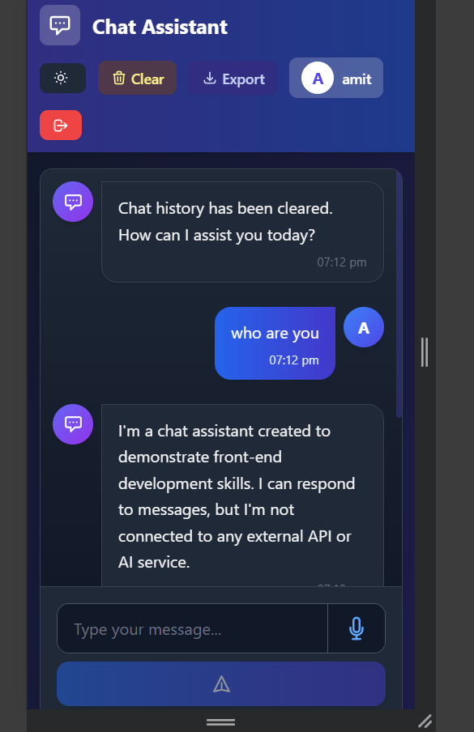
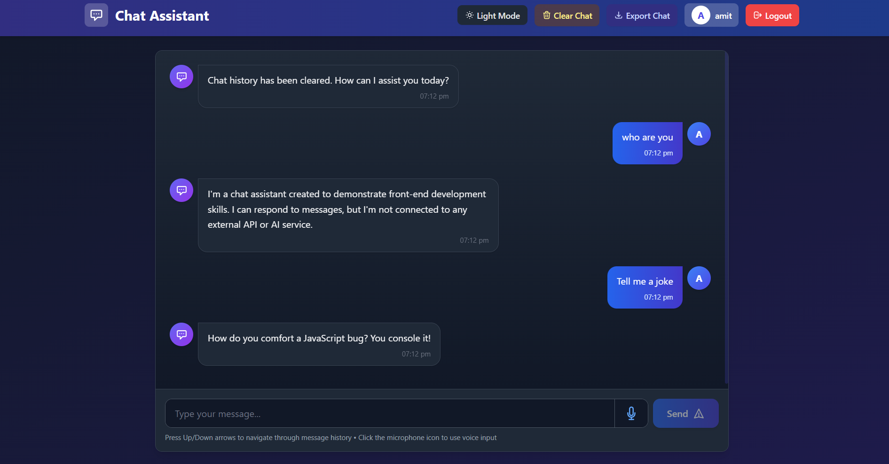

# Chat Assistant - Interactive React Chat Application


## 🚀 Overview

Chat Assistant is a modern, responsive chat application built with React and TypeScript. It features a sleek UI with dark/light mode support, voice input capabilities, and persistent chat history.

## ✨ Features

- 🌓 **Dark/Light Mode** - Toggle between dark and light themes
- 🎙️ **Voice Input** - Speak your messages using the microphone button
- 💬 **Prompt Suggestions** - Quick-access prompts for common queries
- 📜 **Chat History** - Messages persist between page refreshes
- ⬆️ **Message History Navigation** - Use arrow keys to access previous messages
- 📤 **Export Chat** - Download your conversation as a text file
- 📱 **Responsive Design** - Works on mobile, tablet, and desktop screens
- 🔐 **User Authentication** - Secure login/signup system

## 🛠️ Technologies Used

- **Frontend**: React, TypeScript, TailwindCSS
- **State Management**: React Hooks (useState, useEffect)
- **Authentication**: Local Storage (JWT)
- **Styling**: Tailwind CSS with custom gradients
- **Animation**: CSS transitions and keyframes
- **Speech Recognition**: Web Speech API

## 📂 Project Structure

```
project/
├── public/
│   ├── index.html
│   └── assets/
├── src/
│   ├── components/
│   │   └── ...
│   ├── pages/
│   │   ├── Chat.tsx          # Main chat interface
│   │   ├── Login.tsx         # User login page
│   │   └── Signup.tsx        # User registration page
│   ├── services/
│   │   ├── authService.ts    # Authentication functions
│   │   └── ...
│   ├── types/
│   │   └── ...
│   ├── App.tsx
│   └── index.tsx
└── package.json
```

## 🚀 Getting Started

### Prerequisites

- Node.js (v14.0.0 or later)
- npm or yarn

### Installation

1. Clone the repository:
   ```bash
   git clone https://github.com/yourusername/chat-assistant.git
   cd chat-assistant
   ```

2. Install dependencies:
   ```bash
   npm install
   # or
   yarn install
   ```

3. Start the development server:
   ```bash
   npm start
   # or
   yarn start
   ```

4. Open your browser and visit:
   ```
   http://localhost:3000
   ```

## 💡 Usage

1. **Login/Signup**: Create an account or log in to access the chat interface
2. **Send Messages**: Type in the input field and press Enter or click Send
3. **Voice Input**: Click the microphone icon and speak your message
4. **Quick Prompts**: Click on suggested prompts above the input field for quick responses
5. **Export Chat**: Click "Export Chat" to download your conversation
6. **Clear History**: Use the "Clear Chat" button to start fresh
7. **Theme Toggle**: Switch between dark and light modes using the theme button

## 📱 Screenshots

<div style="display: flex; justify-content: space-between; margin-bottom: 20px;">
    
    
</div>


## 🔒 Privacy

- All chat data is stored locally in your browser
- No data is sent to external servers (except for speech recognition which uses your browser's API)
- You can clear your data at any time using the "Clear Chat" button

## 🤝 Contributing

Contributions, issues, and feature requests are welcome! Feel free to check the [issues page](#).

## 📄 License

This project is [MIT](LICENSE) licensed.

---

Made Suman Kumar
